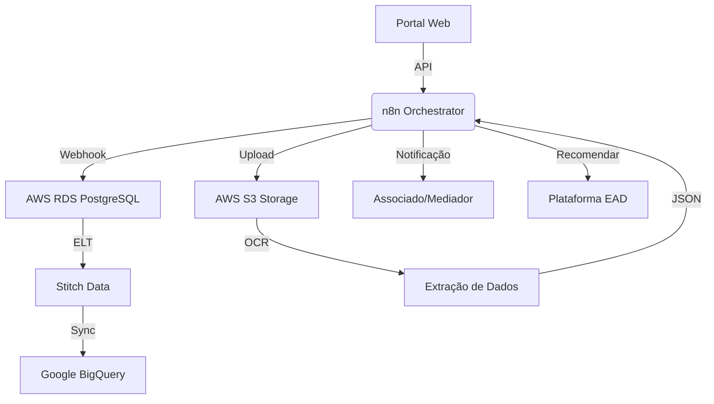

# 🏛️ Arquitetura TJAEM

O ecossistema TJAEM é projetado para ser modular, seguro e escalável, integrando justiça arbitral com tecnologia de ponta.

## 🧱 Componentes Principais

### 1. Camada de Dados (AWS RDS PostgreSQL)
- **Repositório Central:** Armazena processos, usuários e logs de auditoria.
- **Views Críticas:** Utiliza a view `tjaem_critical_deadlines` para monitoramento de prazos em tempo real, servindo de gatilho para automações.

### 2. Automação de Processos (n8n)
- **Cérebro do Sistema:** Orquestrador de workflows que conecta o portal web aos serviços de backend.
- **Integração:** Webhooks bidirecionais para notificações (WhatsApp/SMS), geração de documentos e sincronização de dados.

### 3. Sincronização e BI (Stitch Data)
- **Pipeline ELT:** Sincroniza dados do RDS para o Google BigQuery.
- **Auditoria:** Permite análises históricas e conformidade com as normas CAMEB.

### 4. Gestão de Documentos (AWS S3)
- **Central de Arquivos:** Armazenamento criptografado (AES-256) para petições, atas e evidências.
- **Processamento:** Integrado com OCR para extração automática de metadados.

### 5. Ecossistema Educacional (EAD Moodle)
- **Capacitação:** Módulos recomendados automaticamente com base no tipo de conflito (ex: Mediação Predial para casos condominiais).

## 📊 Fluxo de Dados e Integração

## 🔄 Ciclo de Vida de um Processo
1. **Entrada:** Processo recebido via Webhook no n8n.
2. **Setup:** Criação de estrutura no S3 e registro no PostgreSQL.
3. **Engajamento:** n8n dispara alerta de prazo e sugere curso EAD relacionado.
4. **Resolução:** Geração de minuta de sentença via IA e arquivamento final.
