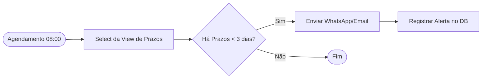
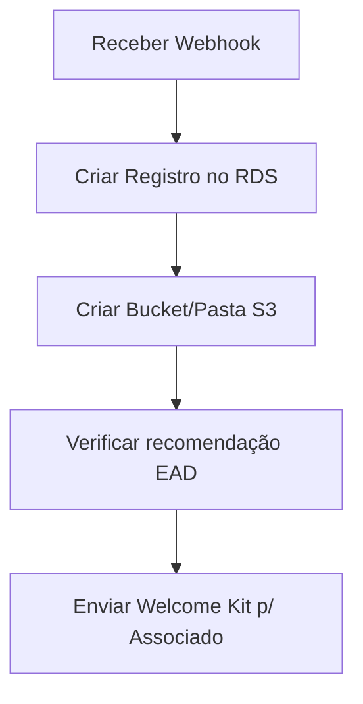
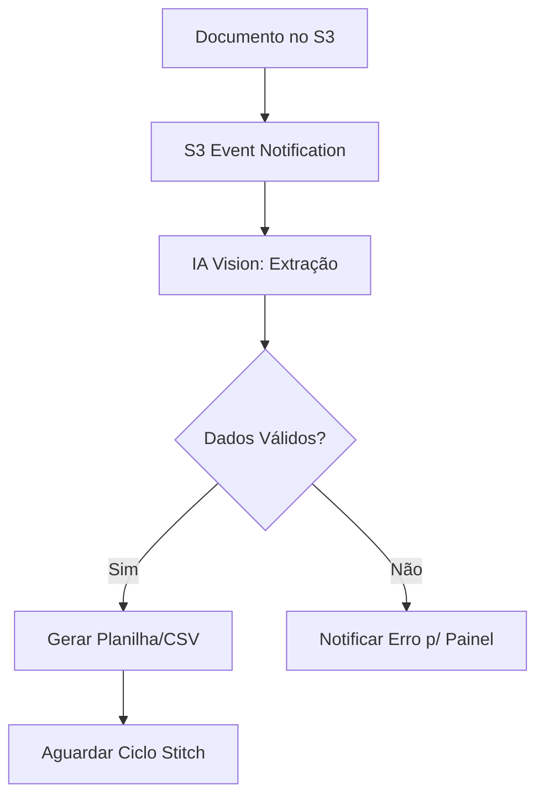

# 🔄 Catálogo de Workflows n8n

Este documento cataloga as principais automações que operam como o "sistema nervoso" do TJAEM.

---

## 1. Monitoramento de Prazos (Deadline Alert)
Verifica a view `tjaem_critical_deadlines` no PostgreSQL e dispara alertas.

- **Frequência:** Diário (manhã).
- **Canais:** WhatsApp (via API externa) e Portal.

---

## 2. Ingestão de Novo Processo
Inicia o setup para todo novo caso arbitral.

- **Gatilho:** API do Portal ou Webhook externo.
- **Ação Crítica:** Vincula automaticamente o curso EAD baseado no campo `tipo_processo`.

---

## 3. Captura OCR e Sincronização (OCR Flow)
Processa imagens de documentos e transforma em dados estruturados.

---

## 4. Sincronização Stitch Data
Pipeline ELT para Business Intelligence.

- **Conector:** PostgreSQL → BigQuery.
- **Tabelas Sincronizadas:** `processos`, `usuarios`, `ead_progresso`, `cobrancas`.
- **Frequência:** A cada 30 minutos.

---

> [!IMPORTANT]
> Todos os logs de execução destes workflows são consolidados na tabela `system_logs` do RDS para auditoria CAMEB.
